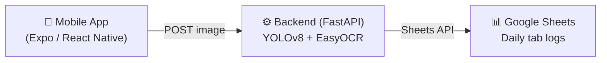

# ANPR Fleet Tool

An end-to-end **Automatic Number Plate Recognition (ANPR)** system built ofr fleet management. A React 
Native mobile app captures a vehicle plate photo, sends it to a FastAPI backend which runs YOLOv8 detection and 
EasyOCR, and automatically logs the recognbised plate to a Google sheet organised by date.

> originally developed as a personal project adn proposed for operational use at **Europcar Mobility Group**

---

## Architecture


 **Flow:**
 1. Staff member opens the app and taps **Scan Plate** - camera opens
 2. Photo is sent to `POST /anpr/detect` - backend runs YOLOv8 to locate the plate, then EasyOCR to read the text
 3. Detatched plate and confidence scores are returned and shown on screen
 4. Staff taps **Confirm & Log** - app sends the plate text to `POST /anpr/log`
 5. Backend deduplicates (ignotres re-logs within 15 seconds) and appends to today's Google Sheet tab

---

## Repository Structure

```
anpr-fleet-tool/
├── backend/                  # FastAPI server — detection, OCR, Sheets logging
│   ├── anpr-server/
│   │   ├── app.py            # FastAPI entrypoint & all endpoints
│   │   ├── ocr.py            # YOLOv8 + EasyOCR pipeline
│   │   ├── sheets.py         # Google Sheets logging & deduplication
│   │   └── models/
│   │       └── detector/
│   │           └── best.pt   # Fine-tuned YOLOv8 weights (see note)
│   ├── data/                 # Training data and annotations
│   ├── notebooks/            # Training and experimentation notebooks
│   ├── runs/                 # YOLOv8 training run logs
│   ├── requirements.txt
│   ├── Dockerfile
│   └── .env.example
├── mobile/                   # React Native (Expo) mobile app
│   ├── app/
│   │   ├── (tabs)/
│   │   │   ├── index.tsx     # Camera capture & detection screen
│   │   │   └── explore.tsx   # Explore / info screen
│   │   └── _layout.tsx
│   ├── components/
│   ├── constants/
│   ├── hooks/
│   └── app.json
├── .gitignore
├── LICENSE
└── README.md
```
 
---
 
## Getting Started
 
### Prerequisites
 
- Python 3.10+
- Node.js 18+ and npm
- Expo Go app on your phone (for mobile testing)
- A Google Cloud service account with Sheets API enabled
 
### Backend Setup
 
```bash
cd backend
 
# Create and activate virtual environment
python -m venv .venv
source .venv/bin/activate        # Windows: .venv\Scripts\activate
 
# Install dependencies
pip install -r requirements.txt
 
# Set up environment variables
cp .env.example .env
# Paste your full Google service account JSON and Spreadsheet ID into .env
 
# Run the server
python anpr-server/app.py
```
 
The API will be available at `http://localhost:8000`.
Interactive docs available at `http://localhost:8000/docs`.
 
> **Note:** The YOLOv8 model loads in a background thread on startup. Check `GET /health` — it returns `pipeline_ready: true` once ready (typically 10–30 seconds).
 
#### Docker
 
```bash
cd backend
docker build -t anpr-server .
docker run -p 8000:8000 --env-file .env anpr-server
```
 
### Mobile Setup
 
```bash
cd mobile
npm install
npx expo start
```
 
Scan the QR code with **Expo Go**, or press `i` / `a` to open in a simulator.
 
Update the backend URL in `mobile/app/(tabs)/index.tsx`:
```ts
const BACKEND_URL = "http://your-server-url";
```
 
> If testing on a physical device with a local backend, use your machine's local network IP (e.g. `http://192.168.x.x:8000`) rather than `localhost`.
 
---
 
## Environment Variables
 
Google credentials are passed as an environment variable (not a file) so secrets are never written to disk in production:
 
```env
GOOGLE_SERVICE_ACCOUNT_JSON={"type":"service_account","project_id":"..."}
```
 
See `backend/.env.example` for the full template.
 
> ⚠️ Never commit `service-account.json` or `.env` — both are covered by `.gitignore`.
 
---
 
## API Endpoints
 
| Method | Endpoint | Description |
|--------|----------|-------------|
| `GET` | `/health` | Server and pipeline status |
| `POST` | `/anpr` | Scan image → detect → log in one call |
| `POST` | `/anpr/detect` | Detect plate from image, return result without logging |
| `POST` | `/anpr/log` | Log a plate text supplied by the client |
 
---
 
## Tech Stack
 
| Layer | Technology |
|-------|-----------|
| Object Detection | YOLOv8 (Ultralytics) |
| OCR | EasyOCR |
| Backend | FastAPI + Uvicorn |
| Image Processing | OpenCV, NumPy |
| Fleet Logging | Google Sheets API v4 |
| Auth | Google Service Account (env var) |
| Containerisation | Docker |
| Deployment | Railway |
| Mobile | React Native (Expo Router) |
| Language | Python 3, TypeScript |
 
---
 
## Model
 
The YOLOv8 nano model (`yolov8n.pt`) was fine-tuned on a custom annotated dataset of NZ vehicle plates. Best weights are saved to `backend/anpr-server/models/detector/best.pt`.
 
> ⚠️ Model weights (`.pt` files) are excluded from this repo via `.gitignore` due to file size. Training notebooks and run logs are in `backend/notebooks/` and `backend/runs/`.
 
---
 
## License
 
MIT — see [LICENSE](LICENSE) for details.
 


...
